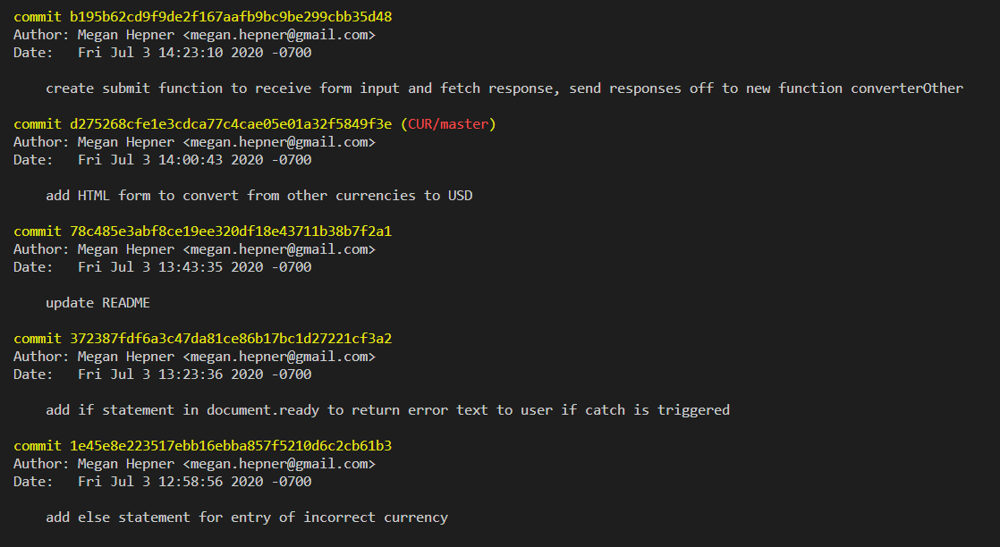
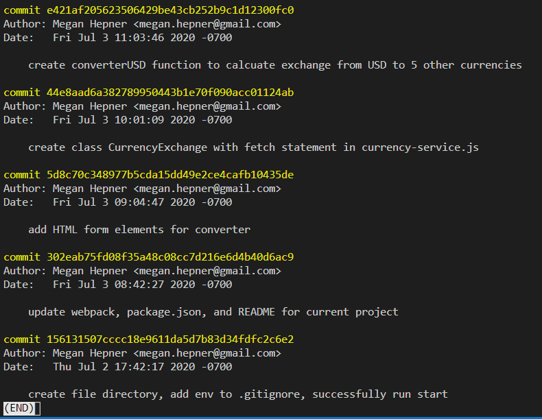

# _currency exchange_

#### _Currency Exhchanger Using Exchange-Rate API, 7.3.20_

#### By _**Megan Hepner**_

## Description
  This is an overview of the work done in week 6 of Epicodus. It converts U.S. Dollars to other currencies using the Exchange-Rate API.  

## Setup/Installation Requirements

* to use this content, first click the green clone button above and copy the link to your clipboard 
* in your terminal run the command "git clone (GitHub url)" to clone the directory to your computer
* you will need Node.js to run commands, go [here](https://nodejs.org/en/) to install the latest version
* with Node.js installed, in your terminal (not in the node.js terminal) run the command npm install
* after install open the files in your code editor
* this webpage uses an API, which provides up to date exchanges for the currencies you will be exchanging. in order to use the API, please follow the next steps carefully and in this exact order :
    * in the root directory of currency converter create a file named .env
    * add .env to the list of files in .gitignore, and save both files
    * in your web browser navigate to the [Exchange Rate API](https://www.exchangerate-api.com/) website
    * use your email address and first name to create an account and recieve a free key
    * copy this API key (it will be a string of alphanumerical characters), and paste it in the .env file after the following text API_KEY = 

### Specs
| Spec | Input | Output |
| :-------------     | :------------- | :------------- |
| **Program returns error if API call results in error** | API call with no key  | TypeError: Failed to fetch  |
| **Program returns error if incorrect currency is chosen** | AED  | "Please choose one of the available currency options and try again!" |
| **Program converts USD to AUD (Australian)** | 20  | 28.88 |
| **Program converts USD to CAD (Canadian)** | 20  | 27.17 |
| **Program converts USD to EUR (Euro)** | 20  | 17.75 |
| **Program converts USD to MXN (Mexico)** | 20  | 451.72 |
| **Program converts USD to JPY (Japan)** | 20  | 2149.07 |

## Support and contact details

_For question, concerns, or if you would like to make contributions to this work, please contact Megan Hepner_

## Technologies Used

Html, CSS, Bootstrap, JavaScript, JQuery

### License

*This software is licensed under the MIT license*

Copyright (c) 2020 **_Megan Hepner_**

